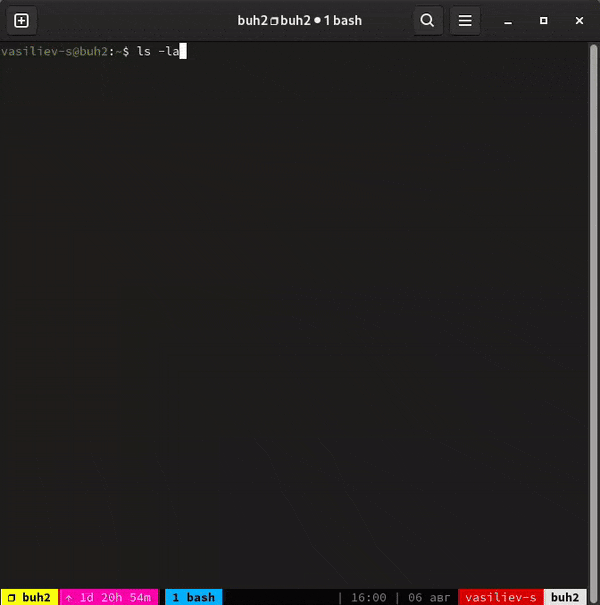
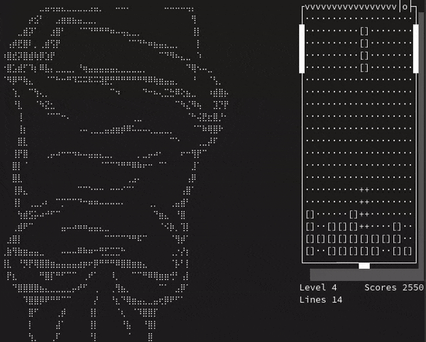

|                       |  |
|-----------------------------------------------------------|--------------------------------------|
| <sup>Запуск в текущей оболочке по комбинации клавиш</sup> | <sup>Случайный кадр из игры</sup>    |

# Введение

Выражаю своё глубокое уважение к создателю оригинальной игры Алексею Леонидовичу Пажитнову, а также владельцам любых прав на бренд Tetris®. Данный код написан исключительно в развлекательных и не коммерческих целях для сугубо личного использования. Все права на Tetris® принадлежат только их законным владельцам.<br/>
<br/>
Посвящаю эту работу Александру Яковлеву (17.05.1976 — 08.07.2010), который будучи ещё школьником написал свой гениальный клон знаменитой игры — BackGround Tetris. Его программа btet.com[^1] работала под ОС MS-DOS на процессорах с архитектурой i286/i386. От множества других резидентных программ того времени, в том числе резидентных реализаций Тетриса, её отличал применённый автором подход: эмулировалась многозадачность, можно было играть в игру, пока на компьютере выполнялись другие программы. Тогда для программ это было совсем не характерно и выглядело очень инновационно. «Многозадачность» в MS-DOS настолько смущала людей, что у меня даже состоялся спор со своим другом на тему того, использует ли btet.com защищённый режим процессора или нет (ответ - «не использует»).<br/>
<br/>
Также посвящаю эту работу Александру Липатову (29.04.1976 — 22.07.2023), с которым мы (я и Манушкин Григорий) в далёком 1994 году, полные надежд, мечтаний и энтузиазма, готовились к конкурсу «Softool\'ийские игры»[^2] на выставке SofTool\'94. Это время было одним из лучших в моей жизни! К сожалению, работы Александра у меня нет. Знаю только, что Александр своё задание выполнил, и только какое-то стечение обстоятельств помешало нам поехать в Москву и принять участие в конкурсе.<br/>
|%2C%20lipatov_alex%20(right)%2C%20~1993%20year.png)|                   |
|------------------------------------------------------------------------------------------------------------------------------------------|----------------------------------------------------------------------------------|
| <sup>Александр Яковлев (слева) и Александр Липатов (справа), предположительно на выпускном вечере в Лицее №14 г. Тамбов (1993 год)</sup> | <sup>Александр Липатов, предположительно 1994 год - таким я его и запомнил</sup> |
[^1]: [Ссылка](abstet/tree/main/retro/btet/) на мой экземпляр BackGround Tetris, который храню уже более 30 лет.
[^2]: Моя работа к конкурсу доступна по [ссылке](abstet/tree/main/retro/SofTool%6094/).

# Описание

**abstet18+.bash** - Tetris 18+ in the Linux terminal / Тетрис 18+ в окне терминала.<br/>


# Установка

Никакая специальная установка не требуется.

1. **sources/abstet18+.bash** разместить в любом доступном для пользователя каталоге<br/>
0. **sources/backgrounds** - каталог с фоновыми ascii изображениями - расположить в каталоге со скриптом abstet18+.bash. При помощи ключей abstet18+.bash можно задать другое расположение каталога. Можно не размещать этот каталог: в этом случае фоновых изображений на уровнях не будет, ошибок скрипт выдавать также не будет.
0. **sources/abstet18+-completion** - файл автоматических дополнений для abstet18+.bash - разместить в /etc/bash_completion.d/ (работает в Fedora 40)<br/>

# Использование

## sources/abstet18+.bash
```
Использование:
  вариант 1:   abstet18+.bash [ОПЦИЯ] ...
  вариант 2: . abstet18+.bash [ОПЦИЯ] ...  - запуск в текущей оболочке (см. опции --bind и --remove)

Опции:
-c, --columns "Число"                    количество колонок у игрового поля (по-умолчанию: 10)
-l, --lines   "Число"                    количество строк у игрового поля (по-умолчанию: 20)

-a, --align "right|left|top|bottom"      к какой границе окна терминала прижать игровое поле (по умолчанию: -a right -a top)
    --background-path "Путь к каталогу"  путь к каталогу с фоновыми ascii изображениями (по умолчанию: ./backgrounds/18+)
-s, --show-hotkeys                       вывести подсказку по клавишам управления (по-умолчанию - не выводить подсказку)

-b, --bind "Комбинация клавиш"           привязать вызов игры к комбинации клавиш (только при запуске в текущей оболочке, иначе игнорируется); комбинацию клавиш можно получить: [Ctrl+V] + [нужная комбинация]
-r, --remove                             удалить скрипт из текущей оболочки (только при запуске в текущей оболочке, иначе игнорируется)

-h, --help                               показывает эту подсказку

Примеры:
abstet18+.bash
abstet18+.bash --align left --align top --show-hotkeys --lines 30 --columns 15
. abstet18+.bash --background-path ~/abstet18+/sources/backgrounds/18+/ --bind ^[t
. abstet18+.bash --remove
```


# Управление в игре

|Управление игрой|   |
|----------------|---|
|новая игра      | n |
|выйти из игры   | q |
|пауза           | p |

|Управление фигурой              |          |
|--------------------------------|----------|
|перемещение влево               | ←        |
|перемещение вправо              | →        |
|вращение по часовой стрелке     | ↑        |
|вращение против часовой стрелки | Ctrl + ↑ |
|сброс soft                      | ↓        |
|сброс hard                      | Space    |

|Управление уровнем|   |
|------------------|---|
|увеличить         | + |
|уменьшить         | - |

|Прочее                                      |   |
|--------------------------------------------|---|
|перерисовать экран                          | r |
|включить или выключить подсказку по клавишам| h |

|Перемещение игрового поля в окне терминала|         |
|------------------------------------------|---------|
|влево                                     | Alt + ← |
|вправо                                    | Alt + → |
|вверх                                     | Alt + ↑ |
|вниз                                      | Alt + ↓ |

|Выравнивание игрового поля в окне терминала|        |
|-------------------------------------------|--------|
|по левой границе окна                      | Home   |
|по правой границе окна                     | End    |
|по верхней границе окна                    | PgUp   |
|по нижней границе окна                     | PgDown |

# Замечания

1. Скорость падения фигуры фигуры на дно. Я старался сделать скорость аналогичной той, которая была в оригинальном Тетрисе для приставки NES в версии NTSC:

|Level 00|Level 01|Level 02|Level 03|Level 04|Level 05|Level 06|Level 07|Level 08|Level 09|Level 10|Level 11|Level 12|Level 13|Level 14|Level 15|Level 16|Level 17|Level 18|Level 19|Level 20|Level 21|Level 22|Level 23|Level 24|Level 25|Level 26|Level 27|Level 28|Level 29|
|--------|--------|--------|--------|--------|--------|--------|--------|--------|--------|--------|--------|--------|--------|--------|--------|--------|--------|--------|--------|--------|--------|--------|--------|--------|--------|--------|--------|--------|--------|
| 15.974 | 14.310 | 12.646 | 10.982 |  9.318 |  7.654 |  5.990 |  4.326 |  2.662 |  1.997 |  1.664 |  1.664 |  1.664 |  1.331 |  1.331 |  1.331 |  0.998 |  0.998 |  0.998 |  0.666 |  0.666 |  0.666 |  0.666 |  0.666 |  0.666 |  0.666 |  0.666 |  0.666 |  0.666 |  0.333 |

Считаю, что реализовать на bash соответствие уровней по скоростям удалось (таймер в скрипте отмеряет время в микросекундах), но обозначилась проблема с вводом и выводом в окне терминала. До 8-го уровня включительно — это когда фигура падает на дно 2,6 секунды — скорость падения соответствует эталонной, но далее… Далее на моём компьютере игра «захлёбывается» при обработке нажатий клавиш и прорисовке экрана. Возможное решение — улучшить игровой алгоритм ввода команд с клавиатуры и оптимизировать работу со строковыми переменными в bash. Но на данный момент мне не известен более оптимальный вариант обработчика нажатий клавиш на bash. Что касается оптимизации работы со строковыми переменными, то здесь, возможно, в коде и можно что-то улучшить, но у меня есть сомнения в большой эффективности этого: всё-таки bash — это не ассемблер или язык высокого уровня, для выполнения простых арифметических операций в bash производятся постоянные преобразование строка-число-строка, т.к. вcе переменные — строковые.
Буду рад любым дельным предложениям по описанным проблемам.

2. Подсчёт очков. Здесь я также старался придерживаться классического подхода (поддерживается всё, кроме трюков T-Spin):

| Вид                   | Очки                                       |
|-----------------------|--------------------------------------------|
| Одна линия            | 100 x уровень                              |
| Две линии             | 300 x уровень                              |
| Три линии             | 500 x уровень                              |
| Четыре линии (tetris) | 800 x уровень; сложное действие            |
| Back-to-Back (BtB)    | непрерывное сложное действие: x1.5 к очкам |
| Комбо                 | 50 x число комбо x уровень                 |

3. Подсказка по следующей фигуре выводится в верхнем левом углу (o, i, l, j, s, z, t - по официальным названиям фигур Тетриса).

# Статистика

## sources/abstet18+.bash
```
  строк кода -------------- 998
  объём кода -------------- 66116 символов
  контрольная сумма MD5 --- df557572e3422a518f7244081637a495
```


<br/>
<br/>
<br/>

---
© 2024 Sergey Vasiliev<br/>
- <a href="mailto:vasiliev.s@komdiv.org" target="_blank">vasiliev.s@komdiv.org</a><br/>
- <a href="mailto:abs.tambov@gmail.com" target="_blank">abs.tambov@gmail.com</a><br/>
